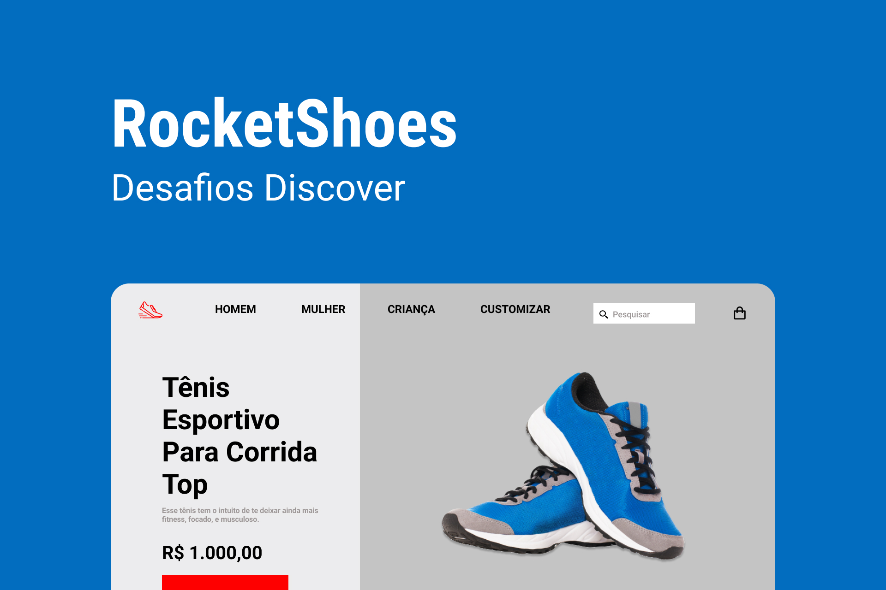

<h1 align="center"> Rocketshoes </h1>

Página de demonstração de um produto para uma empresa imaginária. Esse foi um desafio faz parte de um projeto proposto pela Rocketseat  

  <a href="#-tecnologias">Tecnologias</a>&nbsp;&nbsp;&nbsp;|&nbsp;&nbsp;&nbsp;
  <a href="#-projeto">Projeto</a>&nbsp;&nbsp;&nbsp;|&nbsp;&nbsp;&nbsp;
  <a href="#-layout">Layout</a>&nbsp;&nbsp;&nbsp;|&nbsp;&nbsp;&nbsp;
  <a href="#memo-licença">Licença</a>

  

 

  

## 🚀 Tecnologias

Esse projeto foi desenvolvido com as seguintes tecnologias:

- HTML e CSS
- JavaScript
- Git e Github
- Figma

## 💻 Projeto

Página de demonstração de um produto para uma empresa imaginária com sistema de pré-visualização do produto 💡.

- [Visite o projeto online](https://pedrohenrikle.github.io/shoes-enterprise)

## 🔖 Layout

Você pode visualizar o layout do projeto através [DESSE LINK](<https://www.figma.com/file/MqXQb18QBawGTicV0ZvF14/DD-%2F-RocketShoes-(Copy)?node-id=26%3A7&t=aEbGy7IddVl63MUZ-0>). É necessário ter conta no [Figma](https://figma.com) para acessá-lo.

## :memo: Licença

Esse projeto está sob a licença MIT.

---

Feito com ♥ by Pedro Klein
